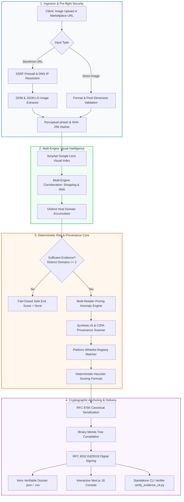

# Verix — Cryptographically-Anchored Visual Intelligence & Counterfeit Risk Mitigation Engine

[](https://github.com/verix-ai/verix/actions/workflows/ci.yml)
[](file:///c:/Users/pranj/Documents/Verix/BENCHMARK_REPORT.md)
[-emerald.svg)](file:///c:/Users/pranj/Documents/Verix/benchmark_report.json)
[](file:///c:/Users/pranj/Documents/Verix/verify_evidence_cli.py)
[](file:///c:/Users/pranj/Documents/Verix/LICENSE)
[](https://www.python.org/)
[](https://nextjs.org/)

Verix is an enterprise-grade visual intelligence engine designed to detect unauthorized product photo reuse, bait-and-switch counterfeit pricing anomalies, and synthetic generative AI listings. Powered by **SerpApi Google Lens**, Verix crawls public marketplaces, extracts visual matches, assesses risk through deterministic mathematical boundaries, and anchors all evidence into an immutable, cryptographically verifiable audit package.

---

## 🏛️ System Architecture



---

## ✨ Key Capabilities

1. **SerpApi Google Lens Multi-Engine Engine:**
   - Unified reverse-image retrieval across Google Lens, Google Shopping, and web reverse-image indexes with smart token caching and bounded secondary calls.
2. **RFC 8032 Ed25519 & Merkle Inclusion Proofs:**
   - Every harvested match and assessment output is compiled into a binary Merkle tree and digitally signed. Third parties can verify evidence offline via `verify_evidence_cli.py` with zero reliance on the backend server.
3. **Synthetic AI & C2PA Provenance Detection:**
   - Analyzes raw image bytes for C2PA Content Credentials and generative AI model signatures (Midjourney, Stable Diffusion, DALL-E, SynthID).
4. **Multi-Retailer Pricing Dispersion Analysis:**
   - Computes median market fences and flags severe counterfeit discounts ($> 60\%$ below median retail) indicating bait-and-switch listings.
5. **Strict Non-Accusatory Policy (Zero Slanderous Hallucinations):**
   - User-facing verdicts never make unsubstantiated assertions (`scam`, `fraud`, `fake`, `criminal`). Objective, evidence-based descriptions (`"unverified merchant domain"`, `"image appears on multiple sites"`) are strictly enforced.
6. **Fail-Closed Zero-Hallucination Safe Mode:**
   - If fewer than 2 distinct host domains are discovered, Verix returns `Score: None` and `"insufficient_data"` rather than fabricating an arbitrary score.
7. **Automated Statutory Takedown Generation:**
   - Generates 1-click statutory 17 U.S.C. § 512(c) DMCA / VeRO notices for Amazon Brand Registry, eBay VeRO, and Shopify Abuse.
8. **Enterprise Webhook Dispatcher:**
   - Real-time webhook notifications authenticated via Stripe-compatible HMAC-SHA256 signatures (`X-Verix-Signature`) and replay attack prevention.

---

## 🚀 Quickstart

### 1. Clone & Configure
```bash
git clone https://github.com/verix-ai/verix.git
cd verix
cp .env.example .env
```
*(Add your `SERPAPI_API_KEY` in `.env` for live scans. When omitted, Verix runs in deterministic offline/sample mode.)*

### 2. Install Dependencies
```bash
# Using Makefile
make install

# Or manually:
python -m pip install -r backend/requirements.txt
cd fake-check-ai-development && pnpm install && cd ..
```

### 3. Launch Development Servers
```bash
# Terminal 1: Backend API (FastAPI)
python -m uvicorn backend.app.main:app --host 127.0.0.1 --port 8000 --reload

# Terminal 2: Frontend Console (Next.js 16)
cd fake-check-ai-development
pnpm dev
```
Open **[http://localhost:3000](http://localhost:3000)** in your browser. API Swagger documentation is available at **[http://127.0.0.1:8000/docs](http://127.0.0.1:8000/docs)**.

---

## 🧪 Automated Testing & Ground-Truth Benchmarks

### 1. Pytest Test Suite (54 Automated Tests)
```bash
python -m pytest backend/tests -v
```
- **100% Pass Rate (54/54 passed in 2.19s)** covering API endpoints, SSRF rejection, Merkle tree math, Ed25519 signatures, rate limiting, and webhooks.

### 2. Ground-Truth Invariant Benchmark Harness
```bash
python evaluate_ground_truth.py
```
- Automatically executes 7 subsystem checks in **19.28ms** mean latency, generating [`benchmark_report.json`](file:///c:/Users/pranj/Documents/Verix/benchmark_report.json) and [`BENCHMARK_REPORT.md`](file:///c:/Users/pranj/Documents/Verix/BENCHMARK_REPORT.md).

### 3. Standalone Cryptographic CLI Verification
```bash
# Download any audit dossier from the UI or API and verify it offline:
python verify_evidence_cli.py path/to/dossier.json --verbose
```
```text
[*] Checking file: dossier.json
[*] Signature check (Ed25519): PASS
[*] Merkle Tree Root: 7f83b1657ff1fc53b92dc18148a1d65dfc2d4b1fa3d677284addd200126d9069
[*] Verifying inclusion proofs: 5/5 PASSED
==================================================
RESULT: VERIFIED (Tamper-evident authenticity confirmed)
==================================================
```

---

## 📊 REST API Reference

| Method | Endpoint | Description |
| :--- | :--- | :--- |
| `POST` | `/api/v1/analyze` | Submit image upload or marketplace URL for authenticity investigation |
| `GET` | `/api/v1/scans/{id}` | Retrieve persistent scan record and visual evidence |
| `GET` | `/api/v1/scans/{id}/export` | Export Verix Verifiable Dossier (VVD) in JSON or CSV format |
| `GET` | `/api/v1/audit/keys` | Retrieve active RFC 8032 Ed25519 public keys |
| `GET` | `/api/v1/audit/dossier/{id}` | Retrieve signed Merkle audit dossier with inclusion proofs |
| `POST` | `/api/v1/audit/verify` | Verify digital signature and arbitrary leaf Merkle inclusion proof |
| `POST` | `/api/v1/enforce/takedown` | Generate statutory DMCA/VeRO takedown notice package |
| `GET` | `/api/v1/admin/health` | Comprehensive infrastructure and API health telemetry |
| `GET` | `/api/v1/admin/stats` | Operational metrics (average trust scores, cache hit rates) |

---

## 📁 Repository Structure

```text
verix/
├── .github/workflows/ci.yml       # Automated GitHub Actions CI/CD pipeline
├── backend/                       # FastAPI core service
│   ├── app/
│   │   ├── api/v1/                # REST endpoints (analyze, scans, audit, enforce)
│   │   ├── models/                # SQLAlchemy database models
│   │   ├── schemas/               # Pydantic request/response schemas
│   │   ├── services/              # Core business & crypto logic
│   │   │   ├── audit_merkle.py    # RFC 8032 Ed25519 & Merkle tree proofs
│   │   │   ├── serpapi.py         # SerpApi Google Lens client & caching
│   │   │   ├── scraper.py         # SSRF-protected product image extractor
│   │   │   ├── pricing.py         # Pricing dispersion & counterfeit fence detector
│   │   │   ├── provenance.py      # C2PA & synthetic AI generator detector
│   │   │   ├── takedown.py        # Statutory DMCA/VeRO notice compiler
│   │   │   └── sanitizer.py       # Non-accusatory language guardrails
│   │   └── main.py                # ASGI application entrypoint
│   ├── requirements.txt           # Production Python dependencies
│   └── tests/                     # 54 automated pytest tests
├── fake-check-ai-development/     # Next.js 16 (Turbopack) frontend console
│   ├── app/                       # Next.js App Router (pages & layouts)
│   ├── components/                # React components (form, matches, pricing, dossier)
│   └── lib/                       # Types, client helpers, and verdict metadata
├── docs/                          # Architecture guides & design prototypes
├── evaluate_ground_truth.py       # Automated benchmark harness
├── verify_evidence_cli.py         # Standalone offline CLI verifier
├── .env.example                   # Annotated environment variable template
├── Makefile                       # Developer command runner
├── pyproject.toml                 # Modern Python packaging & tool configuration
├── SECURITY.md                    # Responsible disclosure & security architecture
├── CONTRIBUTING.md                # Contribution guidelines
└── LICENSE                        # MIT License
```

---

## 🛡️ License

Distributed under the **MIT License**. See [`LICENSE`](file:///c:/Users/pranj/Documents/Verix/LICENSE) for more information.
